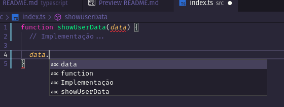
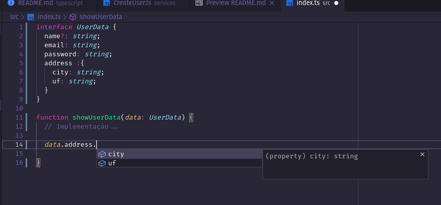

# Conceitos do TypeScript

O typeScript é um `superset` de funcionalidades para o `JavaScript`, ou mesmo uma própria linguagem, que permite a tipagem e a utilização de recursos mais recentes do javascript.

## Tipagem

Algumas das tipagems disponíveis no JavaScript são:

- string
- number
- boolean
- object
- Array

As definições de tipagem auxiliam na identificão de tipo em escopos que o editor não consegu identificar os tipos das variáveis.

```typescript
function helloWorld(request, response) {
  // Corpo da função...
}
```

No exemplo acima, você talvez tenha reconhecido que os parâmetros se tratam de `Request` e `Response` do `express.js`, mas o context no qual este arquivo de encontra, não fornece ao editor a informação necessária para a definição de tipos e, consequentemente, não dará ao programador a possibilidade de utilizar o IntelliSense.

Veja no exemplo abaixo uma outra função:

```typescript
// Retornar uma string no formato: 'Nome, Cidade - Sigla do estado'

function showUserData(data) {
  // Implementação...
}
```

Não há como nós sabermos o formato de `data` e muito menos o editor:

<div align="center">



</div>

Agora veja como ficaria com a tipagem dos parâmetros:

<div align="center">



</div>

A partir deste momento sabemos então que para completar o desafio basta implementar o seguinte:

```typescript
function showUserData(data: UserData) {
  return `${data.name}, ${data.address.city} - ${data.address.uf}`;
}
```
